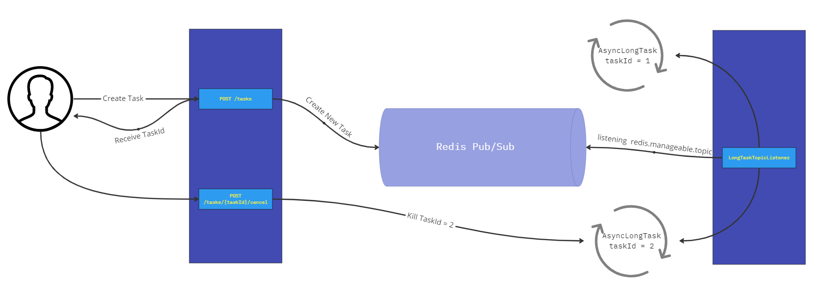

# Manageable Parallel Redis Topics

  
Links Relacionados

  
* [Spring Boot Async Executor Management](https://medium.com/trendyol-tech/spring-boot-async-executor-management-with-threadpooltaskexecutor-f493903617d)
* [FutureTask get VS run task never finishes](https://stackoverflow.com/questions/66588952/futuretask-get-vs-run-task-never-finishes)
* [How to Cancel a Task in Java - ExecutorService](https://howtodoinjava.com/java/multi-threading/executor-service-cancel-task/)
* [How to Cancel Spring Task](https://stackoverflow.com/questions/72706262/how-to-cancel-spring-async-task)
* [Using Java Thread Locals](https://www.north-47.com/microservice-architecture-using-java-thread-locals-and-tomcat-spring-capabilities-for-automated-information-propagation/)
* [Java Dynamic Scheduling Tutorial](https://github.com/mustafabayar/java-dynamic-scheduling-tutorial)
* [Spring Boot Redis pub/sub jhamukul007 Repository](https://github.com/jhamukul007/springboot-redis-pubsub/tree/main)
* [Spring Cancel @Async Task](https://stackoverflow.com/questions/38880069/spring-cancel-async-task)
* [How to cancel ThreadPoolTaskExecutor task](https://stackoverflow.com/questions/61123534/how-to-cancel-threadpooltaskexecutor-task)
* [Dynamic Task Scheduling with Spring Boot](https://riteshshergill.medium.com/dynamic-task-scheduling-with-spring-boot-6197e66fec42)
* [Spring Boot @Async: The magic and the gotchas](https://medium.com/@dvikash1001/springboot-async-the-magic-and-the-gotchas-17f9471c6fe4)
* [How to trigger dynamic scheduling jobs and cancel them](https://stackoverflow.com/questions/65504064/how-to-trigger-dynamic-scheduling-jobs-in-java-and-cancel-them)

